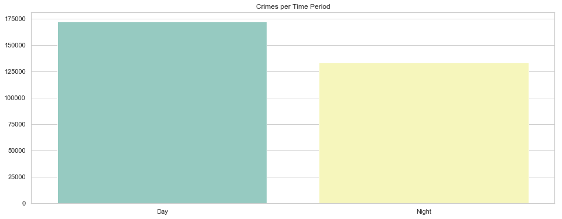

# Contributors

* Sioros Vasileios (billsioros)
* Konstantinos Kyriakos (Qwerkykk)

# Reader:

- Reads the *csv* file and stores it in memory in panda format. If it already exists on the disk in pickled format it loads it instead
- Preprocesses the data (converts NaN values in the 'SHOOTING' column to 'N', drops rows with NaN values, creates the factorized equivilant of each column to be used in the kmeans clustering, etc)


```python
import os

import numpy as np
import pandas as pd

from sklearn.preprocessing import MinMaxScaler

class Reader:

    headers = [
        'INCIDENT_NUMBER',
        'OFFENSE_CODE_GROUP',
        'DISTRICT',
        'SHOOTING',
        'YEAR',
        'MONTH',
        'DAY_OF_WEEK',
        'HOUR',
        'Lat',
        'Long'
    ]

    types = dict(zip(headers, [object, object, object, object, np.int32, np.int32, object, np.int32, np.float64, np.float64]))

    def __init__(self, filename, lat_predicate=lambda entries: entries > 40, lon_predicate=lambda entries: entries < -60):

        if not isinstance(filename, str):
            raise ValueError("'filename' is not an instance of 'str'")

        if not os.path.isdir('out'):
            os.mkdir('out')

        pickled = os.path.splitext(os.path.basename(filename))[0] + '.pkl'

        pickled = os.path.join(os.path.curdir, 'out', pickled)

        if os.path.isfile(pickled):

            print('<LOG>: Loading pickled dataset from', "'" + pickled + "'")

            self.data = pd.read_pickle(pickled)

            print('<LOG>: The dataset consists', len(self.data.index), 'rows and', len(self.data.columns), 'columns')

            return

        print('<LOG>: Processing file', "'" + filename + "'")

        self.data = pd.read_csv(filename, dtype=self.types, skipinitialspace=True, usecols=self.headers)

        print('<LOG>: The dataset consists', len(self.data.index), 'rows and', len(self.data.columns), 'columns')

        self.data['SHOOTING'].fillna('N', inplace=True)

        print('<LOG>: Dropping NaN values')

        self.data.dropna(inplace=True)

        print('<LOG>: Restricting longitude and latitude')

        self.data = self.data[lat_predicate(self.data['Lat']) & (lon_predicate(self.data['Long']))]

        print('<LOG>: Creating column', "'" + 'TIME_PERIOD' + "'")

        self.data['TIME_PERIOD'] = ['Night' if hour <= 6 or hour >= 18 else 'Day' for hour in list(self.data['HOUR'])]

        print('<LOG>: Augmenting the dataset by the factorized equivalent of each column')

        gmin = self.data[['Long', 'Lat']].min().min()
        gmax = self.data[['Long', 'Lat']].max().max()

        for header in self.headers:

            self.data[[header + '_FACTORIZED']] = self.data[[header]].stack().rank(method='dense').unstack()

            self.data[[header + '_FACTORIZED']] = MinMaxScaler((gmin, gmax)).fit_transform(self.data[[header + '_FACTORIZED']])

        print('<LOG>: The dataset consists', len(self.data.index), 'rows and', len(self.data.columns), 'columns')

        print('<LOG>: Saving pickled datafrime to', "'" + pickled + "'")

        self.data.to_pickle(pickled)


    def groupby(self, headers):

        if isinstance(headers, str):
            headers = set([headers])
        elif isinstance(headers, list):
            headers = set(headers)
        else:
            raise ValueError("'headers' must be an instance of 'list'")

        if not headers.issubset(self.headers):
            raise ValueError(headers.difference(self.headers), 'header(s) are not supported')

        return self.data.groupby(list(headers))
```

# KMeans:

- Initialization requires a Reader to be passed as an arguement
- Performs clustering on the dataset according to the geographical location and (optionally) a supplied header / category.


```python
from re import sub

from sklearn import cluster

from reader import Reader
from visualizer import Visualizer

class KMeans:

    def __init__(self, reader):

        if not isinstance(reader, Reader):
            raise ValueError("'reader' is not an instance of 'Reader'")

        self.data = reader.data


    def fit(self, n_clusters=None, header=None):

        if header:

            if not isinstance(header, str):
                raise ValueError("'header' is not an instance of 'str'")

            print('<LOG>: Clustering according to geographical location and', "'" + header.replace('_', ' ').title() + "'")

            header = header + '_FACTORIZED'

            data = self.data[['Long', 'Lat', header]]

            n_clusters = len(self.data[header].unique())

        else:

            if not isinstance(n_clusters, int) or n_clusters <= 0:
                raise ValueError("'n_clusters' must have an integer value greater than zero")

            print('<LOG>: Clustering according to geographical location')

            data = self.data[['Long', 'Lat']]

        print('<LOG>: Running kmeans with', '{0:2}'.format(n_clusters), 'clusters')
        
        return cluster.KMeans(n_clusters=n_clusters).fit(data).labels_.astype(float)
```

# Visualizer:

- Initialization requires a Reader to be passed as an arguement
- Data can be visualized with countplot() and scatterplot()


```python
import seaborn as sns
import matplotlib.pyplot as plt

from reader import Reader

class Visualizer:

    def __init__(self, reader):

        if not isinstance(reader, Reader):
            raise ValueError("'reader' is not an instrance of 'Reader'")

        sns.set(style='whitegrid')

        self.data = reader.data


    def countplot(self, header, title, squeeze=False, predicate=None, figsize=(16, 6), palette='Set3'):

        if not isinstance(header, str):
            raise ValueError("'header' is not an instrance of 'str'")

        if not isinstance(title, str):
            raise ValueError("'title' is not an instrance of 'str'")

        if header == 'DAY_OF_WEEK':
            order = ['Monday', 'Tuesday', 'Wednesday', 'Thursday', 'Friday', 'Saturday', 'Sunday']
        else:
            order = sorted(self.data[header].unique())

        data = self.data

        if predicate:
            data = data[predicate(data)]

        plt.figure(figsize=figsize)

        axes = sns.countplot(x=header, data=data, order=order, palette=palette)

        if header == 'MONTH':
            axes.set_xticklabels(['January', 'February', 'March', 'April', 'May', 'June', 'July', 'August', 'September', 'October', 'November', 'December'])

        axes.set_title(title)

        axes.set(xlabel='', ylabel='')

        if squeeze:
            axes.set_xticklabels(axes.get_xticklabels(), rotation=90, fontsize=7, ha='left')

            plt.tight_layout()

        plt.show()


    def scatterplot(self, hue, title, figsize=(12, 12), palette='Set2'):

        plt.figure(figsize=figsize)

        axes = sns.scatterplot(x='Long', y='Lat', data=self.data, hue=hue, palette=palette, legend=False)

        axes.set(xlabel='Longitude', ylabel='Latitude')

        if title:
            axes.set_title(title)

        plt.show()
```

# Map:

- Initialization requires a Reader to be passed as an arguement
- The display() uses a header / category and a coloring attribute to group and colorize the incidents accordingly


```python
import folium
from folium import IFrame
from folium import Popup
from folium.plugins import MarkerCluster
from IPython.core.display import display

from reader import Reader

table = """
<!DOCTYPE html>
<html>

<head>
    <style>
        #info {{
            font-family: "Trebuchet MS", Arial, Helvetica, sans-serif;
            border-collapse: collapse;
            width: 100%;
        }}

        #info td,
        #info th {{
            border: 1px solid #ddd;
            padding: 8px;
        }}

        #info tr:nth-child(even) {{
            background-color: #f2f2f2;
        }}

        #info tr:hover {{
            background-color: #ddd;
        }}

        #info th {{
            padding-top: 12px;
            padding-bottom: 12px;
            text-align: left;
            background-color: rgb(86, 76, 175);
            color: white;
        }}
    </style>
</head>

<body>

    <table id="info">
        <tr>
            <th>Incident Number</th>
            <th>{}</th>
        </tr>
        <tr>
            <td>{}</td>
            <td>{}</td>
        </tr>
    </table>

</body>

</html>
""".format

class Map:

    def __init__(self, reader, sample_size=500):

        if not isinstance(reader, Reader):
            raise ValueError("'reader' is not an instance of 'Reader'")

        if sample_size:
            if not isinstance(sample_size, int) or sample_size <= 0:
                raise ValueError("'sample_size' must have an integer value greater than zero")

            self.sample_size = sample_size

            self.data = reader.data.sample(n=sample_size)

        else:
            self.data = reader.data

        self.center_x, self.center_y = self.data['Lat'].mean(), self.data['Long'].mean()


    def display(self, header,coloring_attr = 'YEAR', predicate=None, zoom_start=11, popup_width=400, popup_height=100):

        if not isinstance(header, str):
            raise ValueError("'header' is not an instance of 'str'")
        
        if not isinstance(coloring_attr,str):
            raise ValueError("'coloring_attr' is not an instance of 'str'")

        data = self.data[['INCIDENT_NUMBER', 'Lat', 'Long', header,coloring_attr]]

        if predicate:
            data = data[predicate(self.data)]

        locations, popups ,icons = {}, {}, {}

        available_colors = [ 'blue', 'green', 'purple', 'orange', 'darkred',
            'lightred', 'beige', 'darkblue', 'darkgreen', 'cadetblue',
            'darkpurple', 'gray']
        
        unique_tag = list(set(data[coloring_attr]))
    
        color_pallete = {}
        
        for tag in unique_tag:
            color_pallete[tag] = available_colors[unique_tag.index(tag)]
        
        for key in color_pallete.keys():
            print('<' + str(key) +': ' + str(color_pallete[key]) + '>',end =" ")
        
        formatted_header = header.replace('_', ' ').title()

        for _, row in data.iterrows():

            if not row[header] in locations:
                locations[row[header]] = []
                popups[row[header]] = []
                icons[row[header]] = []

            locations[row[header]].append([row['Lat'], row['Long']])    
            
            icons[row[header]].append(folium.Icon(color=color_pallete[row[coloring_attr]]))
            
            html = table(formatted_header, row['INCIDENT_NUMBER'], str(row[header]).title())

            ifrm = IFrame(html=html, width=popup_width, height=popup_height)
            popups[row[header]].append(Popup(ifrm))

        underlying = folium.Map(location=[self.center_x, self.center_y], zoom_start=zoom_start)

        for key in locations.keys():

            group = folium.FeatureGroup(str(key).title())
        
            group.add_child(MarkerCluster(locations[key], popups[key],icons[key]))

            underlying.add_child(group)

        underlying.add_child(folium.LayerControl())

        display(underlying)
```


```python
reader = Reader('../data/crime.csv')
```

    <LOG>: Processing file '../data/crime.csv'
    <LOG>: The dataset consists 327820 rows and 10 columns
    <LOG>: Dropping NaN values
    <LOG>: Restricting longitude and latitude
    <LOG>: Creating column 'TIME_PERIOD'
    <LOG>: Augmenting the dataset by the factorized equivalent of each column
    <LOG>: The dataset consists 305542 rows and 21 columns
    <LOG>: Saving pickled datafrime to '.\out\crime.pkl'
    


```python
visualizer = Visualizer(reader)
```


```python
visualizer.countplot('YEAR', 'Crimes per Year')
```


```python
visualizer.countplot('MONTH', 'Crimes per Month')
```


```python
visualizer.countplot('DAY_OF_WEEK', 'Crimes per Day')
```


```python
visualizer.countplot('DISTRICT', 'Crimes per District')
```


```python
visualizer.countplot('YEAR', 'Shootings per Year', predicate=lambda data: data['SHOOTING'] == 'Y')
```


```python
visualizer.countplot('DISTRICT', 'Shootings per District', predicate=lambda data: data['SHOOTING'] == 'Y')
```


```python
visualizer.countplot('TIME_PERIOD', 'Crimes per Time Period')
```





```python
visualizer.countplot('OFFENSE_CODE_GROUP', 'Types Of Crime During The Day', predicate=lambda data: data['TIME_PERIOD'] == 'Day', squeeze=True)
```


```python
title = 'Geospatial Clustering [{} clusters]'
```


```python
visualizer.scatterplot(KMeans(reader).fit(2), title.format(2))
```

    <LOG>: Clustering according to geographical location
    <LOG>: Running kmeans with  2 clusters
    


```python
visualizer.scatterplot(KMeans(reader).fit(3), title.format(3))
```

    <LOG>: Clustering according to geographical location
    <LOG>: Running kmeans with  3 clusters
    


```python
visualizer.scatterplot(KMeans(reader).fit(5), title.format(5))
```

    <LOG>: Clustering according to geographical location
    <LOG>: Running kmeans with  5 clusters
    


```python
visualizer.scatterplot(KMeans(reader).fit(10), title.format(10))
```

    <LOG>: Clustering according to geographical location
    <LOG>: Running kmeans with 10 clusters
    


```python
visualizer.scatterplot(KMeans(reader).fit(header='MONTH'), 'Crimes per Month')
```

    <LOG>: Clustering according to geographical location and 'Month'
    <LOG>: Running kmeans with 12 clusters
    


```python
visualizer.scatterplot(KMeans(reader).fit(header='OFFENSE_CODE_GROUP'), 'Crimes per Offense Type')
```

    <LOG>: Clustering according to geographical location and 'Offense Code Group'
    <LOG>: Running kmeans with 67 clusters
    


# *Note*

We encountered some rendering problems, so we plot only a sample of the data. The sampling amount is passed as a parameter to the 'Map' class constructor and the default value is 500.


```python
Map(reader).display('OFFENSE_CODE_GROUP',coloring_attr = 'YEAR')
```

    <2016: blue> <2017: green> <2018: purple> <2015: orange> 


# Conclusions:

- Most incidents occurred in 2017.
- Most incidents occurred between June and September.
- Slightly more incidents occurred on Fridays.
- The districts with the most criminality are A1 , B2, B3, C11 and D4.
- Most incidents happened during the day and most of them were either larceny or motor vehicle accidents.
